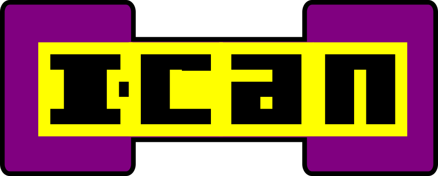
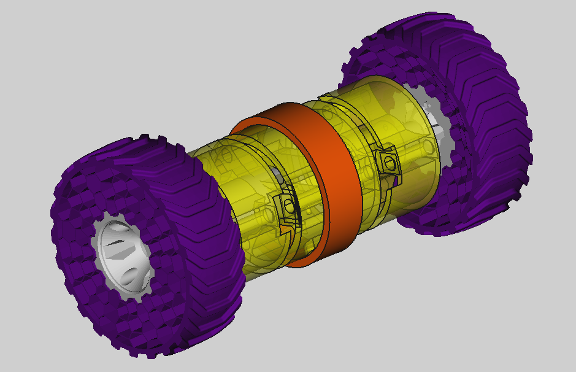
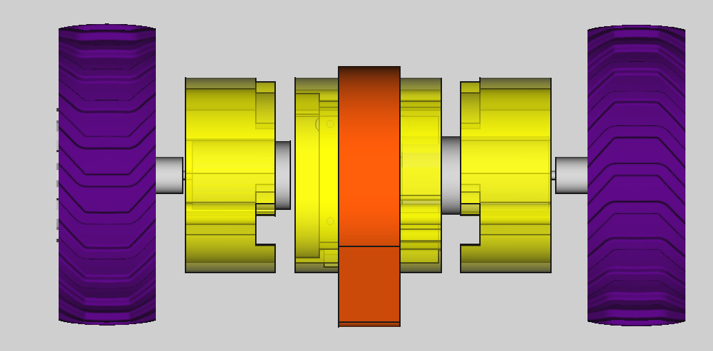

<<<<<<< HEAD
<table>
<tr>
<td>

</td>
</tr>
</table>

# I-CAN

## BOM
- 2 Geared motor 
- [OmniBoard](https://github.com/alvaroferran/OmniBoard) or ESP motor board
- 1 one cell Battery
- 3D printed parts
- [AirPad](https://github.com/owenlab/AirPad) app for Android

## Files

The Motors uses standard RC coupling, so you can fit all kinds of OpenRC Wheels 

## Contributing
1. Fork it!
2. Create your feature branch: `git checkout -b my-new-feature`
3. Commit your changes: `git commit -am 'Add some feature'`
4. Push to the branch: `git push origin my-new-feature`
5. Submit a pull request :D

## Credits

[Alvaro Ferrán](https://github.com/alvaroferran) for the OmniBoard

Designed by Gianluca Pugliese [Owensource](https://www.owensource.com) 

[Make2Race](http://www.thingiverse.com/thing:523776) for the Wheels

## License

This robot is licensed under a [Creative Commons Attribution-ShareAlike 4.0 International License](http://creativecommons.org/licenses/by-sa/4.0/). Please read the LICENSE files for more details.

Este robot tiene una licencia [Creative Commons Attribution-ShareAlike 4.0 International License](http://creativecommons.org/licenses/by-sa/4.0/). Por favor, lea los ficheros LICENSE para más detalles
=======
# Ican
flex can bot

>>>>>>> origin/master
